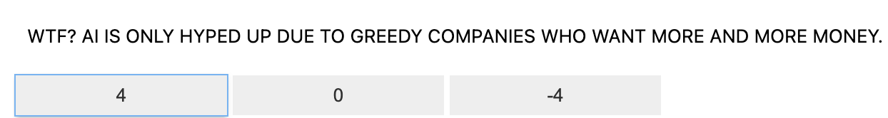
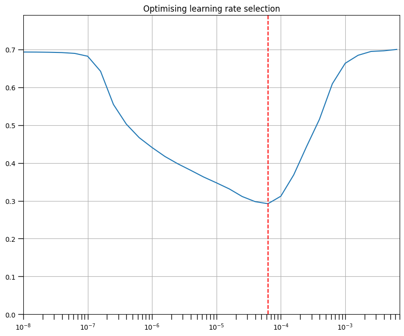

# soc-data 
This project was done at an internship at [TerraNexum](https://www.terranexum.com/)

A huge thank you to my mentor Dahl Winters. 
## Libraries and datasets used
### Data
* [1.6 million labeled tweets](https://www.kaggle.com/datasets/kazanova/sentiment140)
* Self-labeled training/testing data - See [Twitter.ipynb](https://github.com/terranexum/soc-data/blob/main/notebooks/Twitter.ipynb)
### Libraries
* [Pandas](https://pandas.pydata.org/docs/)
* [Tweepy](https://docs.tweepy.org/en/stable/)
* [NumPy](https://numpy.org/doc/)
* [TensorFlow](https://www.tensorflow.org/api_docs)
* [Keras](https://keras.io/api/)
* [ipywidgets](https://ipywidgets.readthedocs.io/en/stable/)
* [Pickle](https://docs.python.org/3/library/pickle.html)
* [Matplotlib](https://matplotlib.org/stable/index.html)
## Overview
The primary objective is to develop a sentiment analysis model that can accurately classify tweets based on their sentiment. 
The notebooks are structured as follows:

1.	Retrieve [(Twitter.ipynb)](https://github.com/terranexum/soc-data/blob/main/notebooks/Twitter.ipynb): Connect to the Twitter API to retreive tweets
    
2.	Manual Classification [(label.ipynb)](https://github.com/terranexum/soc-data/blob/main/notebooks/label.ipynb): This notebook allows users to manually classify the retrieved tweets into different sentiment categories.

3.	Sentiment Analysis Model - large training data [(new data classifying large.ipynb)](https://github.com/terranexum/soc-data/blob/main/notebooks/new%20data%20classifying%20large.ipynb): Train and evaluate a model trained off of 1.6 million tweets

4. Sentiment Analysis Model - small training data [(new_Data classifying small.ipynb)](https://github.com/terranexum/soc-data/blob/main/notebooks/new_Data%20classifying%20small.ipynb): Similar to the former, train and evaluate model trained off of only 100 tweets

## Twitter.ipynb
> NOTE: this code requires "Basic" teir access to the X (fka Twitter) API as of July 2024
>
> For more info click [here](https://developer.x.com/en)

Using Tweepy and the Twitter API, this code allows for the user to retreive up to 100 tweets at a time. The user first authenticates using a bearer token and designs a query to their liking. The retrieved tweets are stored in a list and then printed for inspection. The script ensures all tweets are appended correctly to the list for further processing. A Pandas DataFrame is created to store the tweet texts. This DataFrame is then saved as a CSV file named **tweets.csv** for easy access and further analysis.

## label.ipynb

After rettreiving the tweets from Twitter, now they can be classified by hand. After loading the tweets file, an interactive widget is made to streamline the labeling process. Tweets that display positive sentiment are labeled as 4, neutral sentiment as 0, and negative sentiment as -4. After all tweets in the .csv are labeled, a new .csv titled **combined_tweets_with_sentiment_labeled.csv** is created that contains both the text in the tweet, as well as the sentiment classification.

## new data classifying large.ipynb

The goal of this is to train a reasonably accurate sentiment analysis model off of a very large dataset.

First, the dataset of [1.6 million tweets](https://www.kaggle.com/datasets/kazanova/sentiment140) is formatted into a data frame. URls, @s, and special characters are removed, the strings are stemmed, and then tokenized to be fed into the model as both training and testing data. 

The neural network used in the notebook is a Sequential model built with TensorFlow and Keras. It starts with an Embedding layer that converts input tokens (words) into dense vectors of a fixed size (embedding_dim = 300), capturing the semantic meaning of the words. Following this, a Bidirectional Long Short-Term Memory (LSTM) layer with 64 units processes the input sequence in both forward and backward directions. The next layer is a fully connected Dense layer with 64 units and a ReLU (Rectified Linear Unit) activation function, which learns complex features from the LSTM output. The final layer is a Dense layer with a single unit and a sigmoid activation function, outputting a value between 0 and 1 to represent the probability of the input belonging to the positive class. The model is compiled using the binary cross-entropy loss function for binary classification and the Adam optimizer for efficiency.

Durring training, multiple epochs are run at incrimentally different training rates. Once the optimal rate is found, the model is further trained using that rate to ideally acheive higher accuracies when predicting tweet sentiment. 

After training is completed, then the previously hand classified tweets are uploaded and formatted similarly to the 1.6 million tweets. By using the evaluate function, the new tweets and their sentiment classifications can be used to test the accuracy of the final model. 

## new_Data classifying small.ipynb

The thought behind including this model is to compare the accuracies of sentiment analysis models trained off of 1.6 million tweets and only 100. 

Functionally, both models are nearly identical appart from their differences in training data and model scaling. The tweets are formatted and cleaned in the same fashion, and both are eventually evaluated off of the same tweets from before. 

>Comparisons may not be as accurate if using the same tweets to train the model and evaluate. If needed, gather more tweets and classify them using the same method as before